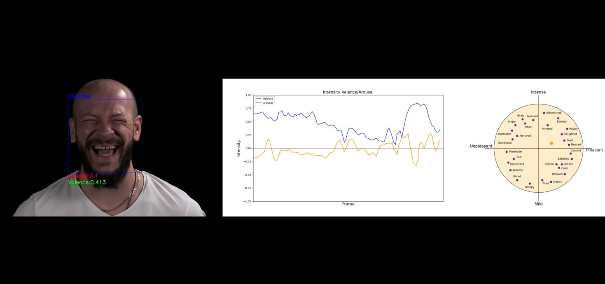

# Recognition of Discrete and Continuous Human Emotions by Facial Image

  This project is a machine learning model that recognizes discrete and continuous emotions from an input image. The model is trained on the AffectNet dataset, which contains about 1 million face images collected from the Internet using three major search engines using 1,250 emotion-related keywords in six languages. About half of the extracted images (~420k) are manually tagged for the presence of seven discrete facial expressions (categorical model) and intensity of valence and arousal scores (dimensional model). The remaining images (~550k) are automatically tagged using the ResNext neural network, trained on all manually tagged training examples with an average accuracy of 65%. AffectNet is the largest database of faces, containing facial expressions, valence and arousal corresponding to a particular facial expression.

## Model description
  Model DescriptionThe model architecture for discrete model recognition is based on ResNet50 with added attention layers to improve model quality. The project automatically creates a debug directory, which contains logs folders for logging model steps, a weights folder for saving weights of trained models, and a summary folder for recording from TensorBoard.
  
## Operation modes
  The code can work in two modes: training and inference. With inference we load video into the input_video folder. The model processes the video and creates additional graphs for a more detailed description of the emotional background of the person under study.
  
## Example of model work
  In the directory you can find an example of how the model works in MP4 format.
  
## Installation and use

If you have pre-trained weights
  - clone a repository
  - set the dependencies
  - upload the video to the folder ./data/input_video
  - run the main.py file with working_status = 'inference'

If you do not have a pre-trained weights:
  - clone a repository
  - set the dependencies
  - set working_status = 'train' in config/parametrs.py
  - for the parameters emo_model, arr_model, val_model in the same file, 
    put the values None, so that the model does not refer to non-existent weights
  - run the main.py file 

